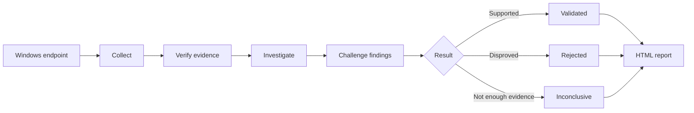
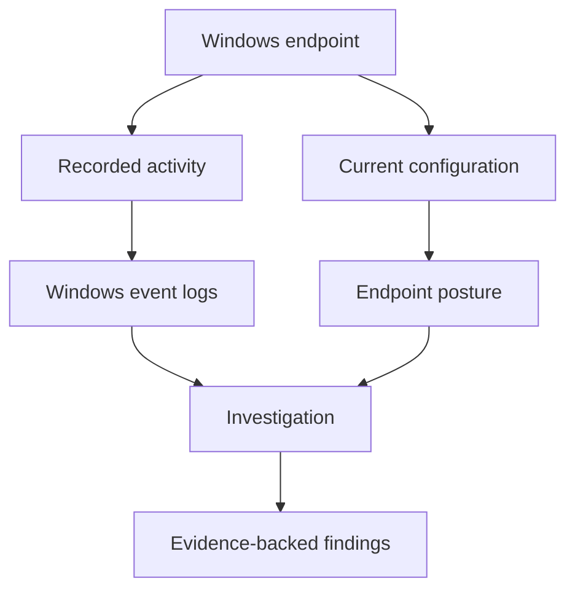
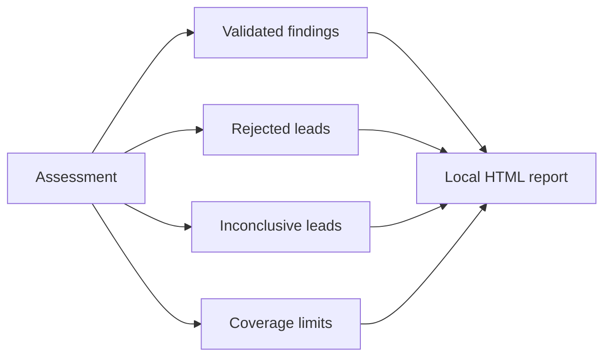

# Verifact 👁️

**Evidence-backed Windows security assessment for AI agents.**

Verifact is a skill that lets an AI agent assess one authorized Windows computer.

It checks existing Windows activity and current system configuration, investigates possible security issues, verifies the supporting evidence, and creates a local HTML report.



> [!IMPORTANT]
> A suspicious signal does not automatically become a finding. Verifact checks the evidence and reviews the finding before publication.

## What it checks

| Area | Examples |
|---|---|
| **Windows activity** | Sign-ins, account changes, processes, services, PowerShell, RDP, WMI, WinRM |
| **Persistence** | Services, scheduled tasks, startup items, Run keys, WMI subscriptions |
| **Accounts** | Local users, administrators, password policy, lockout policy, user rights |
| **Network exposure** | Firewall rules, listening ports, RDP, WinRM, SMB shares |
| **Security settings** | Audit policy, UAC, LSA settings, SMB signing, SMBv1, PowerShell v2 |
| **System state** | Windows version, updates, restart state, security-relevant software |
| **Permissions** | Share permissions and important local file permissions |

Verifact can also use existing **AppLocker, Code Integrity, and Sysmon** logs.

The default event window is **120 days**.

## Evidence before conclusions

Verifact uses two evidence sources:



Verifact does not enable logging or install additional collectors.

It verifies selected evidence before analysis. Each validated host finding must point to the local record that supports it.

Missing evidence stays visible.

> [!NOTE]
> **"Nothing found" and "could not check" are different results.**

## Finding results

| Result | Meaning |
|---|---|
| ✅ **Validated** | The available evidence supports the finding after review |
| ❌ **Rejected** | The evidence does not support the lead |
| ❔ **Inconclusive** | The available evidence cannot resolve the lead |

Candidate findings go through a challenge step before publication. The review checks for missing evidence, contradictions, reasonable benign explanations, and incorrect severity or confidence.

## What you get

A local HTML report with:

- validated findings and their evidence
- rejected and inconclusive leads
- collection scope
- coverage gaps and limitations
- assessment and report verification information



Assessments are stored under:

```text
%LOCALAPPDATA%\Verifact\Assessments\
```

## Install

### Codex

Send this to Codex:

```text
Use $skill-installer to install https://github.com/Rayan-and-beyond/Verifact/tree/main/.agents/skills/verifact
```

<details>
<summary><strong>Claude Code</strong></summary>

Copy:

```text
.agents/skills/verifact
```

to:

```text
~/.claude/skills/verifact
```

The installed entry file must be:

```text
~/.claude/skills/verifact/SKILL.md
```

</details>

<details>
<summary><strong>Other agent CLIs</strong></summary>

Install the `.agents/skills/verifact` folder with the normal skill installation method for your agent.

</details>

## Use

### Codex

```text
Use $verifact to assess this authorized Windows computer end to end.
```

### Claude Code

```text
/verifact assess this authorized Windows computer end to end.
```

For a shorter event window:

```text
Use $verifact to assess this authorized Windows computer for the last 30 days.
```

## Requirements

| | Requirement |
|---|---|
| **OS** | Windows 10 or 11 |
| **PowerShell** | 5.1 or later |
| **Python** | 3.10 or later |
| **Agent** | Skill support and terminal access |
| **Access** | Permission to assess the computer |

## Scope

Verifact performs a **bounded, read-only, point-in-time assessment of one computer**.

It does not provide continuous monitoring, antivirus, EDR, exploitation, or remediation. It does not change logging or system security settings.

> [!WARNING]
> A Verifact assessment cannot prove that a computer is secure or uncompromised. Reports can contain sensitive system data. Keep them private.

---

`2.0.0` · MIT License
