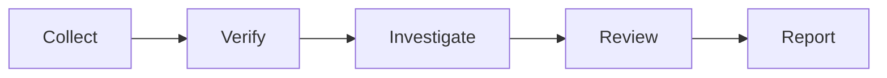
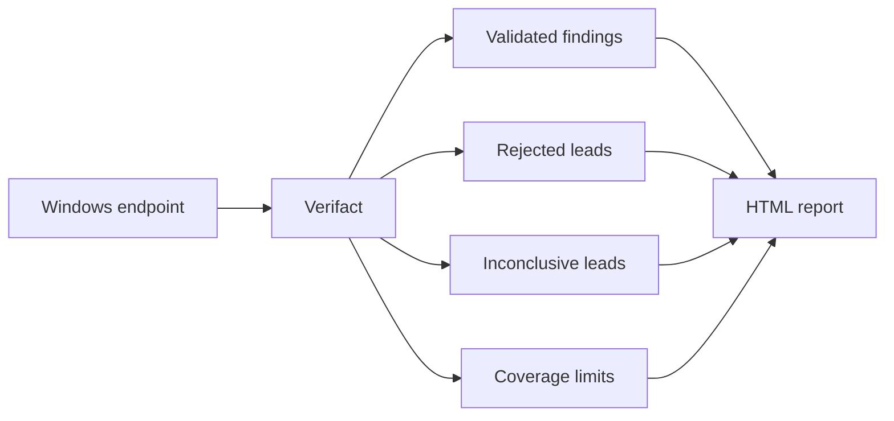

# Verifact 👁️

**Evidence-backed Windows security assessment for AI agents.**

Verifact is a skill for AI agents that performs a bounded, read-only security assessment of one Windows computer. It analyzes events already recorded in the Windows Security log and related Windows event logs, checks local system configuration, reviews possible findings, and creates a local HTML report with supporting evidence and clear coverage limits.


## 🔎 What Verifact checks

Verifact looks at two things: **what happened on the computer** and **how the computer is configured now**.

It uses Windows Security, System, Application, PowerShell, Remote Desktop, Task Scheduler, WMI, WinRM, and Windows Firewall logs. It can also use AppLocker, Code Integrity, and Sysmon logs when they already exist.

It checks endpoint configuration such as accounts, persistence, firewall exposure, listening ports, shares, permissions, audit settings, updates, and Windows security settings.

| Area | Examples |
|---|---|
| **Activity** | Sign-ins, account changes, processes, services, PowerShell, RDP |
| **Persistence** | Services, tasks, startup items, Run keys, WMI |
| **Access** | Users, administrators, passwords, user rights, shares |
| **Exposure** | Firewall rules, open ports, RDP, WinRM, SMB |
| **Posture** | Audit settings, UAC, SMB signing, updates, permissions |

The default event window is **120 days**.

Verifact does not enable logging or install collectors.


## ⚙️ How it works



The agent collects available evidence, verifies it, investigates possible findings, and reviews them before publication.

Windows can request Administrator approval to read protected security data.


## 🧠 How findings work

A suspicious signal does not automatically become a finding.

Verifact checks the evidence behind each candidate and performs a separate review before assigning a final result.

| Result | Meaning |
|---|---|
| ✅ **Validated** | The evidence supports the finding |
| ❌ **Rejected** | The evidence does not support the lead |
| ❔ **Inconclusive** | The available evidence cannot settle it |

Validated findings point back to the local records that support them.


## 📡 Coverage matters

Verifact records what it could assess and what it could not.

A log with no relevant activity is different from a log that was disabled, missing, or inaccessible.

> [!NOTE]
> **"Nothing found" and "could not check" are different results.**

Missing evidence stays visible in the report as a coverage limit.


## 📊 What you get

Verifact creates a local HTML dashboard with:

- validated findings and supporting evidence
- rejected and inconclusive leads
- collection scope and coverage limits
- assessment and report verification details



Assessments are stored under:

```text
%LOCALAPPDATA%\Verifact\Assessments\
```

The report is saved as:

```text
report\index.html
```


## 📦 Install

### Codex

```text
Use $skill-installer to install https://github.com/Rayan-and-beyond/Verifact/tree/main/.agents/skills/verifact
```

Restart Codex if it asks you to.

### Claude Code

Copy:

```text
.agents/skills/verifact
```

to:

```text
~/.claude/skills/verifact
```

The installed entry file should be:

```text
~/.claude/skills/verifact/SKILL.md
```

### Other agent CLIs

Install `.agents/skills/verifact` with your agent's normal skill install method.


## ▶️ Use

### Codex

```text
Use $verifact to assess this authorized Windows computer end to end.
```

### Claude Code

```text
/verifact assess this authorized Windows computer end to end.
```


## Requirements

- Windows 10 or 11
- PowerShell 5.1+
- Python 3.10+
- An agent CLI with skill and terminal access
- Permission to assess the computer


## Limits

Verifact checks **one computer at a time** and performs a **point-in-time, read-only assessment**.

It is not antivirus, EDR, continuous monitoring, exploitation, or remediation. It does not change logging or system security settings.

A Verifact assessment cannot prove that a computer is fully secure.

> [!WARNING]
> Reports can contain sensitive system data. Keep them private.

---

`2.0.0` · MIT License
